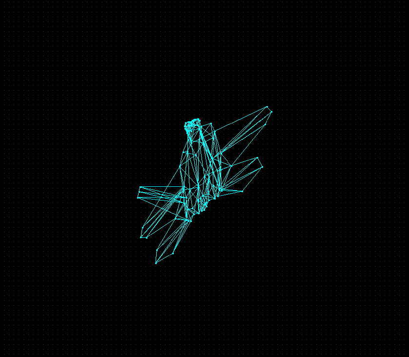

# Software-Renderer
C++ Software Renderer - based on the course taught by Gustavo Pezzi at pikuma.com

Rather than directly copy the C renderer taught in the Gustavo's course, I decided it would be a better learning experience for me to create my own using C++. 

This is just a fun learning exerpience, nothing in this code will be highly optimised or efficient.

Current status - backface culling, naive painter's algorithm and full matrix and vector library for transforms:

