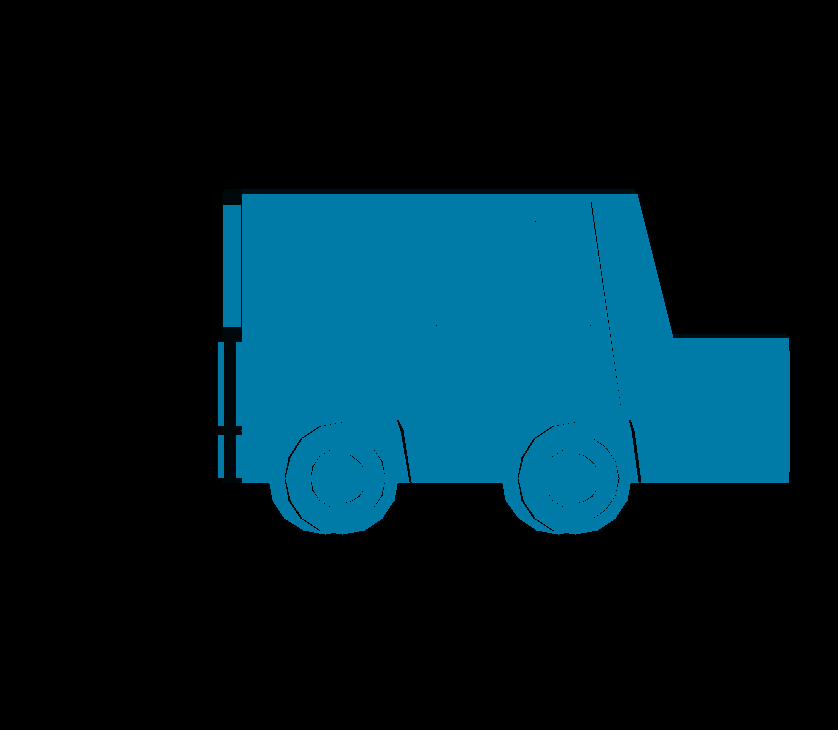

# Software-Renderer
C++ Software Renderer - based on the course taught by [Gustavo Pezzi](https://pikuma.com). Rather than directly copy the C renderer taught in the Gustavo's course, I decided it would be a better learning experience for me to create my own using C++. 

This is just for fun, nothing in this code will be highly optimised or efficient. Everything here is done from complete scratch on the CPU. The only requirement is SDL2 for simply drawing a pixel on the screen.

**Current status:** backface culling, naive painter's algorithm, (incredibly) basic lighting, full matrix and vector library for transforms.

Low poly car donated by [Gabriel Brennan](https://www.artstation.com/gabrielcbrennan).
